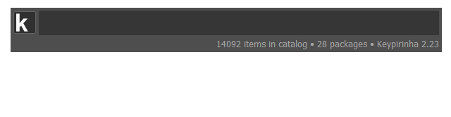

# Keypirinha Plugin: Thino

Obsidianの「Thino」スタイルのメモを「Keypirinha」からデイリーノートへ追記するプラグイン

This is a plugin of [Keypirinha](http://keypirinha.com) for appending [Thino](https://github.com/Quorafind/Obsidian-Thino)-style memos to Obsidian Dailynotes via Obsidian CLI.

## Install

### Managed

Use [PackageControl](https://github.com/ueffel/Keypirinha-PackageControl), a package manager that easy to install third-party packages.

### Manually

1. Download the latest `Thino.keypirinha-package` file from [Release](https://github.com/shuGH/keypirinha-thino/releases).
2. Move it to the `InstalledPackage` folder located at:
    * `Keypirinha\portable\Profile\InstalledPackages` in **Portable mode**
    * `%APPDATA%\Keypirinha\InstalledPackages` in **Installed mode**

## Usage

1. Obsidian CLIを有効にしてください
   - cf. https://obsidian.md/ja/help/cli
2. Keypirinhaを起動し、`Thino:` などの設定済みラベルを入力します
3. 保存したいメモを入力します
4. `Append` または `Append and Open` を実行します
   - `Append`: Dailynoteへメモを追記します
   - `Append and Open`: メモを追記し、Obsidianで対象ノートを開きます

Dailynoteが存在しない場合でも、Obsidian CLIの `daily:append` によりDailynoteが作成されてからメモが追記されます

1. Enable Obsidian CLI.
   - cf. https://help.obsidian.md/cli
2. Launch Keypirinha and type `Thino:` or another configured label.
3. Type your memo.
4. Execute `Append` or `Append and Open`.
   - `Append`: Append memo to Dailynote.
   - `Append and Open`: Append memo and open the Dailynote in Obsidian.

Even if a Dailynote does not exist, it will be created via Obsidian CLI `daily:append` and then the memo will be appended.

## Configure

Vault名、メモ形式、改行ルールなどを設定できます
詳細は `thino.ini` ファイルを参照してください

- `memo_format` は Python の `strftime` 構文および `{MEMO}` の置換ホルダーをサポートします、中括弧をそのまま出力したい場合は `{{}}` のように二重にしてください
- 異なる Vault や別の形式でメモを残したい場合は、`[custom/*]` セクションを増やしてラベルやフォーマットを分けてください

You can set Vault name, memo format, newline behavior and more.
See `thino.ini` file for details.

- `memo_format` supports Python `strftime` syntax and `{MEMO}` replaceholder. Use double braces like `{{}}` when you want to output braces literally.
- To use different Vaults or different memo formats, add additional `[custom/*]` sections and separate labels and formats accordingly.

## Change Log

### v1.1

* Added optional blank line control before memo based on Dailynote trailing blank line.
* Renamed `append_newline` setting to `append_newline_after_memo` with backward compatibility.

### v1.0

* Added basic feature to append Thino-style memo to Obsidian Dailynote via Obsidian CLI.

## License

This package is distributed under the terms of the [MIT](https://github.com/shuGH/keypirinha-thino?tab=MIT-1-ov-file) license.

## Author

[Shuzo.Iwasaki](https://github.com/shuGH)

※ This package is developed with AI-assisted coding.

( • ̀ω•́ )و enjoy!
